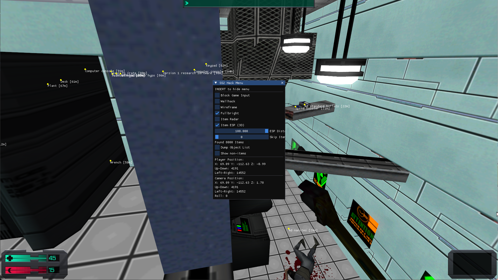

# Aura-Sight: System Shock 2 Internal

**Aura-Sight (霊視 - Reishi)** is a specialized exploration tool for the original **System Shock 2 (1999)**. It provides advanced visualization and information gathering capabilities, perfect for game archaeology and deep exploration of the Von Braun.

## Features
- **Item Radar**: 2D top-down view of all entities in the current level.
- **3D ESP**: Labels and distance indicators for items and interactive objects.
- **Wallhack & Wireframe**: Visualize the station's geometry and hidden paths.
- **Fullbright**: Illuminate the darkest corners of the ship.
- **Internal ImGui Menu**: Easy-to-use interface with input blocking.

## Compatibility
- **System Shock 2 (1999)**: Specifically tested on the Steam release (non-anniversary). SteamDB: [App ID 238210](https://steamdb.info/app/238210/).
- **SS2Tool v6.1**: Optimized for use with the [SS2Tool v6.1 update](https://www.systemshock.org/index.php?topic=4141.0).

## Usage
1. Build the project using `build.bat` (requires MSVC) or use the provided `hook.dll`.
2. Launch System Shock 2.
3. Inject `hook.dll` into `ss2.exe` using one of the following methods:
   - **Cheat Engine**: Open `ss2.exe`, go to `Memory View` -> `Tools` -> `Inject DLL`. [Cheat Engine Official](https://www.cheatengine.org/).
   - **AeroInject**: A lightweight and fast injector. [GitHub: phys-winner/AeroInject](https://github.com/phys-winner/AeroInject).
4. Press **INSERT** to toggle the menu.
5. Press **END** to safely unload the DLL from the game.

## Screenshot

## Contributors
- **Antigravity** (Architect & Code Refinement)

## Roadmap
- [ ] Improve performance (add caching for object names)
- [ ] Add filtering for objects (skip drawing ESP for non-interactive objects)
- [ ] Add support for formatting display names (amount of nanites, ammo, etc.)
- [ ] Implement better radar
- [ ] Add support for custom FOV setting (cam_ext.cfg -> fov)
- [ ] Improve wallhack, fullbright, wireframe logic

---
*Disclaimer: This project is for educational and exploration purposes only.*

## License
This project is licensed under the MIT License - see the [LICENSE](LICENSE) file for details.
